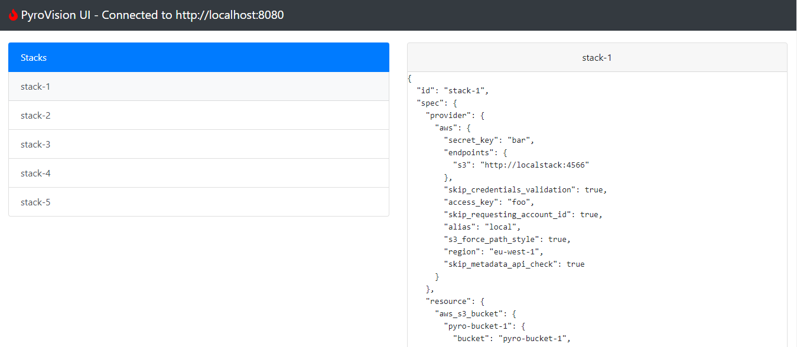

# :fire: PyroVision  
  
```text  
      _____             __      ___     _             
     |  __ \            \ \    / (_)   (_)            
     | |__) |   _ _ __ __\ \  / / _ ___ _  ___  _ __  
     |  ___/ | | | '__/ _ \ \/ / | / __| |/ _ \| '_ \ 
     | |   | |_| | | | (_) \  /  | \__ \ | (_) | | | |
     |_|    \__, |_|  \___/ \/   |_|___/_|\___/|_| |_|
             __/ |                                    
            |___/
```  
Infrastructure as Code as a RESTful service, powered by Terraform.  

## :mag: Overview

> :warning: PyroVision is still in a development state. Feel free to play around and give feedback!

### :satellite: Create Terraform stacks over a REST API, in a managed way.


### :rainbow: See and manage your stacks in the UI



## :arrow_up: Features  
  
### :wrench: Managed Infrastructure as code  
  
**PyroVision** provides a **RESTful integration** for Terraform, which helps you centrally **manage your Infrastructure.** 
You can use JSON syntax to specify your regular Terraform resources, while using a **hosted API** to manage common  
Terraform frustrations, such as keeping a unified version across developers and managing the state file.  
  
### :iphone: User interface for stack management  
  
On top of this, **PyroVision** has a **simple UI**, which gives you an overview of the stacks you have deployed,  
and provides easy management for deleting and updating them.  
  
### :battery: Power-up using a full programming language  
  
The fact that **PyroVision** is **language-agnostic**, can help you in powering up your IaC setup.  
Being able to use the tools of a **full programming language**, allows you to integrate   
your application and its infrastructure more easily. You will also be able to **generate repetitive resources**,   
create **intuitive wrappers for your development teams** or even **apply automated checks**   
on planned changes before actually committing them.  

### :zap: React to Infrastructure changes in your environment using events

**Pyrovision** can be integrated with **event services**, so that other applications 
can **respond to changes** in your environment. The current implementation supports AWS SNS, but can be extended with other
event services, such as Kafka, Queues or EventBridge.

## :one: Get started  
  
### :computer: Local setup
This repository holds a **docker-compose** file that can be used to set up a PyroVision server with needed backend resources. For this example a DynamoDB implementation is used as `StackStore`
and the `LocalTerraformClient` is used as Terraform backend. 
Both classes can be interchanged with custom implementations. Extend the ABC classes in the `api` package to provide custom implementations.  
The 'Configuration' section below will guide you on how to configure the classes used.
  
The command to run is simply:  
```  
docker-compose up  
```  
The server will be running at http://localhost:8080.  
  
The UI will be running at http://localhost:5000.  

### :hammer: Configuration

Configurations are managed through a central `config.yalm` file in the working directory. 
You can change the path of this file by setting the `PYROVISION_CONFIG_FILE` environment variable in the API.
By overriding the classes in this config file, you can **provide your own implementations** for different backends.
In the future, this project will also contain more options for backends. 

To create your own backend, extend the abstract base classes in the `pyrovision.api` package. 
Examples can be found in `pyrovision.base`.

Below you will find an example of a `config.yaml` file.

```yaml
# Stack Store backend. Here AWS DynamoDB on localstack
stackstore:
  implementation: pyrovision.base.stackstore.dynamodb.DynamoDBStackStore
  dynamodb:
    table: "pyrovision-table"
    partition_key: partition_key
    region: eu-west-1
    endpoint_url: "http://localstack:4566"
    aws_access_key_id: foo
    aws_secret_access_key: bar


# Notification backend. Here AWS SNS on localstack
notification:
  implementation: pyrovision.base.notification.sns.SNSNotifier
  sns:
    topics:
      stack_updated: "arn:aws:sns:us-east-1:000000000000:StackUpdated"
      stack_deleted: "arn:aws:sns:us-east-1:000000000000:StackDeleted"
    region: eu-west-1
    endpoint_url: "http://localstack:4566"
    aws_access_key_id: foo
    aws_secret_access_key: bar


# Terraform client implementation. Here the LocalTerraformClient
terraform:
  client: pyrovision.base.terraform.local.LocalTerraformClient
```
## :construction: Roadmap  
  
Currently, on the roadmap are the following topics  
* Enable **more features from the UI**, such as deleting and creating stacks  
* Provide a **Java SDK** and improve the Python SDK  
* **Authentication** module for the API   
* Extensive **unit testing** for the API / SDK  
* CI flows to create proper **releases**  
* **Kafka Notification service** with examples  
* Implement more **Terraform features** through the API
* **Improve documentation** and add **more examples**
